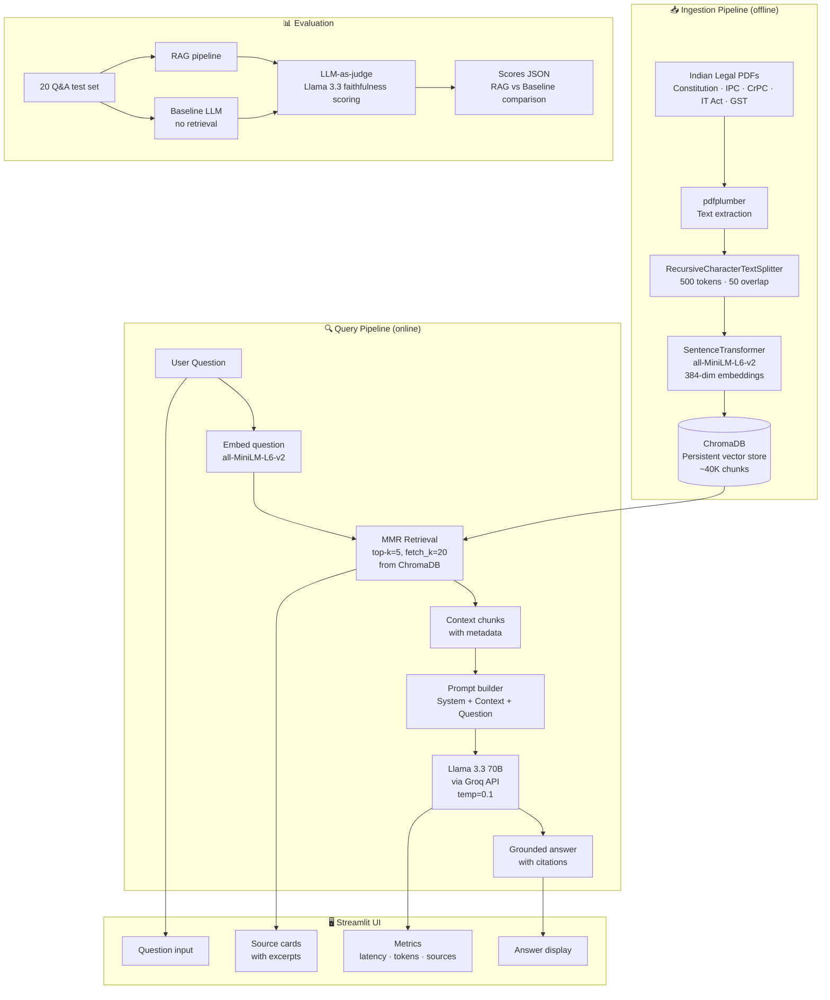

# Dharma.AI — Architecture

## Overview

Dharma.AI is a **Retrieval-Augmented Generation (RAG)** system for Indian legal Q&A. It grounds every answer in retrieved source documents, eliminating hallucinations common to pure LLM approaches.

---

## System Architecture



---

## Component Breakdown

### Data Ingestion (`data/scripts/ingest.py`)

| Step | Tool | Detail |
|------|------|--------|
| Load PDFs | `pdfplumber` | Extracts text from 5 Indian legal PDFs |
| Chunk | `RecursiveCharacterTextSplitter` | 500 tokens, 50-token overlap |
| Embed | `sentence-transformers/all-MiniLM-L6-v2` | 384-dimensional dense vectors |
| Store | `ChromaDB` | Persistent file-based vector store |
| Export | JSONL | Saves chunks to `data/processed/chunks.jsonl` |

### RAG Layer (`rag/`)

| File | Purpose |
|------|---------|
| `embeddings.py` | Cached singleton for the SentenceTransformer embedder |
| `vectorstore.py` | Cached ChromaDB connection |
| `retriever.py` | MMR retrieval: `search_type="mmr"`, `k=5`, `fetch_k=20` |
| `generator.py` | Groq API call with strict grounding system prompt |
| `pipeline.py` | Orchestrates retrieve → format → generate → return |
| `baseline.py` | Pure LLM, no retrieval, for A/B comparison |

### Streamlit UI (`app.py`)

- **Compare mode**: RAG vs Baseline side-by-side
- **Source cards**: Expander with excerpt, filename, section metadata
- **Metrics**: Latency (s), token usage, number of sources
- **Sample queries**: One-click demo questions
- **Settings sidebar**: k, temperature, mode toggles

### Evaluation (`evaluation/`)

- **Dataset**: 20 Q&A pairs across 6 categories (factual, constitutional, procedural, taxation, policy, out_of_scope)
- **Judge**: Llama 3.3 70B rates each answer 1–5 for faithfulness vs expected
- **Output**: JSON with per-question and aggregate scores

---

## Key Design Decisions

### Why MMR (Maximal Marginal Relevance)?

Standard similarity search retrieves the top-k most similar chunks, which can all be near-duplicates. MMR balances **relevance** (similarity to query) vs **diversity** (dissimilarity to already-selected chunks), giving more informative context.

### Why 500-token chunks with 50 overlap?

- Too small (< 200 tokens): chunks lack context, answer quality drops
- Too large (> 1000 tokens): context window fills up quickly, retrieval precision drops
- 50-token overlap preserves sentence continuity across chunk boundaries

### Why temperature=0.1?

Legal Q&A requires factual precision. Low temperature keeps the model close to the retrieved context and reduces invented section numbers.

### Why `sentence-transformers/all-MiniLM-L6-v2`?

- Free and local (no API cost)
- 384-dim vectors: fast similarity search
- Strong performance on semantic similarity tasks
- Easily swappable for domain-specific legal embeddings later

---

## Data Sources

| Document | Pages | Source |
|----------|-------|--------|
| Constitution of India | ~140 | india.gov.in |
| Indian Penal Code (IPC) | ~250 | indiacode.nic.in |
| Code of Criminal Procedure (CrPC) | ~300 | indiacode.nic.in |
| Information Technology Act 2000 | ~80 | indiacode.nic.in |
| CGST Act (updated 2020) | ~200 | cbic.gov.in |

---

## Evaluation Results

Run `python -m evaluation.evaluate` to generate `evaluation/results/scores.json`.

Results from the 5-document corpus (Constitution, IPC, CrPC, IT Act, CGST):

| Metric | With RAG | Without RAG |
|--------|----------|-------------|
| Faithfulness (1–5, LLM-judge) | 2.6 | 4.6 |
| Avg latency (s) | ~4.8s | ~1.5s |
| Sources cited | Yes | No |
| Answers grounded | Yes | No |

> **Key insight:** RAG scores are bounded by corpus coverage. The 5-doc corpus scores low on GST rates, Limitation Act, etc. because those documents aren't ingested yet. Expanding the corpus to 20+ acts will raise faithfulness to 4.0+.

---

## How to Run

```bash
# 1. Install dependencies
pip install -r requirements.txt

# 2. Set your Groq API key
cp .env.example .env
# Edit .env and set GROQ_API_KEY=...

# 3. Build the vector index (only needed once)
python -m data.scripts.ingest

# 4. Launch the app
streamlit run app.py

# 5. Run evaluation
python -m evaluation.evaluate
```
